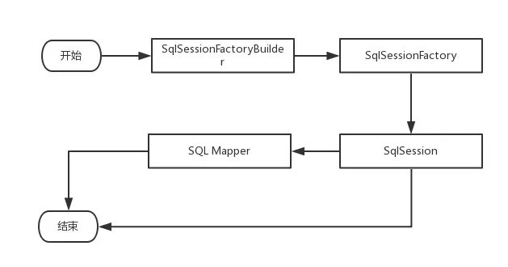

# mybatis-learning

#### GOALS: 
1. review important concepts of mybatis framework, for example: parsing, reflection, exceptions, datasource, transaction, cache, type, io, logging, annotation, binding 
2. initialize and configure mybatis framework.
3. the process which execute CRUD operation with mybatis framework
4. learning plugin and extension in mybatis. such as: PageHelper, MyBatis-Spring, etc.
5. the framework of spring integration with mybatis.

#### NOTES:
Mybatis components:
1. SqlSessionFactoryBuilder: create SqlSessionFactory object.
2. SqlSessionFactory: create SqlSession object.
3. SqlSession: execute CRUD operation.
4. Sql Mapper: the interface which define CRUD operation.

#### DEBUG:
1. import the schema and generate database table;
2. code the java bean;
3. code the mapper interface;
4. the properties file;
5. mybatis-config.xml;
6. main method;
~~~
public class Main {
    public static void main(String[] args) {
        String resource="mybatis-config.xml";
        InputStream inputStream=null;
        try {
            inputStream = Resources.getResourceAsStream(resource);
        } catch (IOException e) {
            // TODO Auto-generated catch block
            e.printStackTrace();
        }
        SqlSessionFactory sqlSessionFactory=null;
        sqlSessionFactory=new SqlSessionFactoryBuilder().build(inputStream);
        SqlSession sqlSession=null;
        try {
            sqlSession=sqlSessionFactory.openSession();
            RoleMapper roleMapper=sqlSession.getMapper(RoleMapper.class);
            Role role=roleMapper.getRole(1L);
            System.out.println(role.getId()+":"+role.getRoleName()+":"+role.getNote());
            sqlSession.commit();
            
        } catch (Exception e) {
            // TODO Auto-generated catch block
            sqlSession.rollback();
            e.printStackTrace();
        }finally {
            sqlSession.close();
        }   
    }
}
~~~
